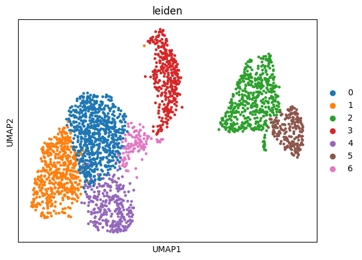

# PBMC3k scRNA-seq Pipeline (Sections 1–10)

A complete single-cell RNA-seq analysis pipeline implemented in Python/Scanpy,
following the **sc-best-practices** guide up to **Section 10: Clustering**.

## 🧬 Dataset
**10x Genomics PBMC 3k** — human peripheral blood mononuclear cells  
Loaded directly via `sc.datasets.pbmc3k()` (≈ 3 000 cells).

## ⚙️ Workflow Steps
1. **Quality control (QC)** – filter low-quality cells and high-mitochondrial ones  
2. **Normalization** – total-count normalization to 10 000 UMIs per cell  
3. **Log-transform** – stabilize variance  
4. **Highly Variable Genes (HVGs)** – select top 2 000 genes  
5. **Scaling** – z-score per gene  
6. **PCA** – linear dimensionality reduction  
7. **Neighbors graph** – kNN graph in PC space  
8. **Leiden clustering** – community detection  
9. **UMAP** – 2D embedding for visualization  
10. **Visualization** – clusters shown by Leiden IDs (0 – 6)

## 📊 Example Output
UMAP projection colored by Leiden clusters:



Each cluster represents transcriptionally distinct immune populations
(e.g., T cells, B cells, monocytes, NK cells — to be annotated later).

## 🧰 Dependencies
Create a Python environment and install:
```bash
pip install scanpy matplotlib seaborn

